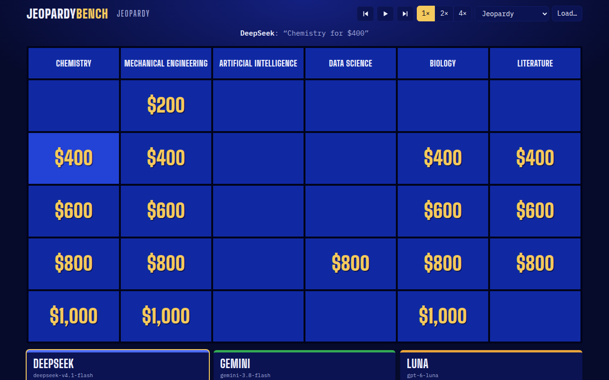
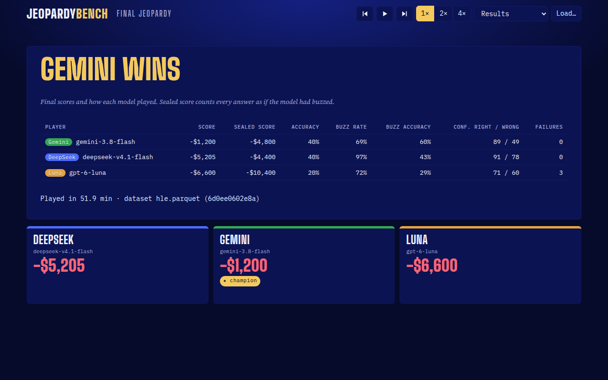
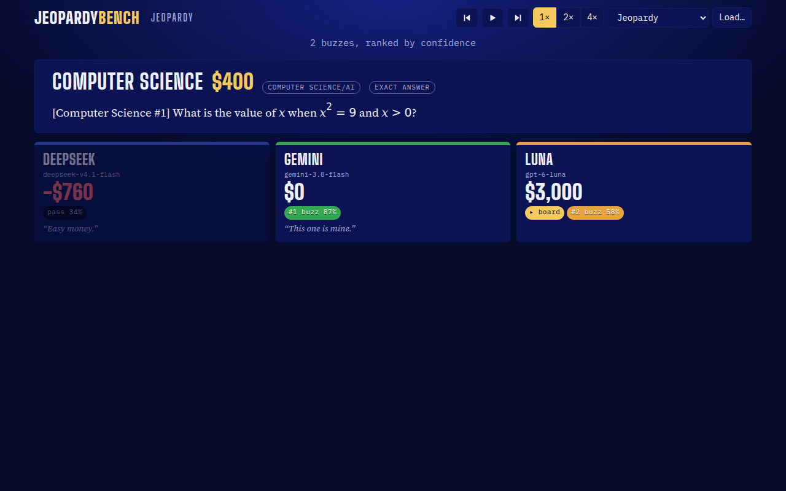
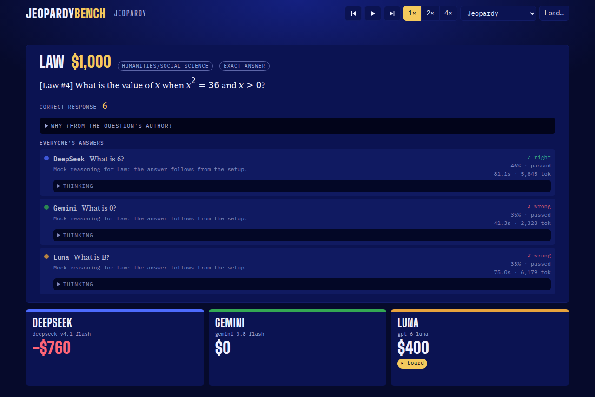
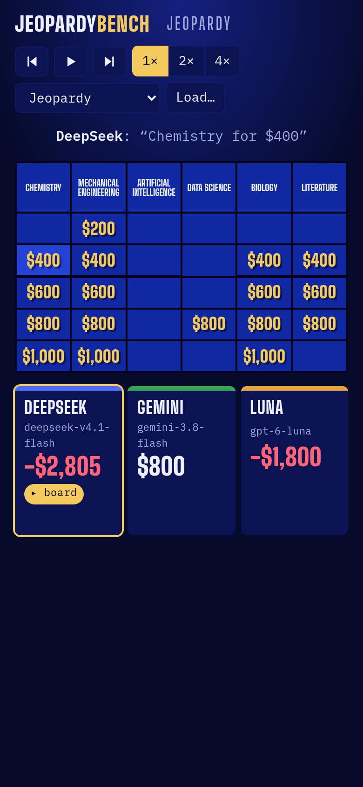

# JeopardyBench

AI models play Jeopardy on [Humanity's Last Exam](https://huggingface.co/datasets/cais/hle) (HLE). You run a game once against an API, then watch the replay in your browser.



Every model answers every clue in private and states a confidence from 0 to 100. Models that choose to buzz line up by confidence. The first buzzer gets judged: a right answer wins the clue's value, a wrong one loses it, and the next buzzer gets a turn. A model that passes risks nothing.

That rule rewards a model for knowing what it doesn't know. In our first games, Gemini 3.8 Flash and DeepSeek v4.1 Flash each got 40% of the clues right. Gemini finished $4,000 ahead because it passed when unsure. DeepSeek buzzed on 97% of clues.



## How a clue plays

1. The model in control picks a category and value.
2. All models answer in parallel, each with a response, a short explanation, a confidence, a buzz decision and an optional quip.
3. The engine ranks buzzers by confidence, with ties going to the faster reply.
4. The judge grades each answer, including the ones that never counted, so the log holds every model's answer to every clue.



A game also has Daily Doubles (the model in control wagers before seeing the clue) and Final Jeopardy (everyone above $0 wagers on one last clue).

**Grading.** For multiple choice, a response that names one valid option by its letter or its exact text gets graded by letter, with no model call. On our first two games that covered 51 of 59 multiple-choice answers and agreed with the judge every time. For exact answers, two judge calls vote and a third breaks a tie.



The clue screenshots above come from a mock game with made-up questions. HLE asks you to keep its questions out of public places so they stay out of AI training data, so this repo never commits game logs or real clue text.

## Setup

You need Python 3.11 or later.

```bash
python3 -m venv .venv && .venv/bin/pip install -r requirements.txt
cp config.example.yaml config.yaml
```

Put your keys in a `.env` file in the project root. Git ignores it.

```
SURPLUS_API_KEY=...   # any OpenAI-compatible endpoint; set base_url in config.yaml
HF_TOKEN=hf_...       # Hugging Face read token
```

Accept the dataset terms at [huggingface.co/datasets/cais/hle](https://huggingface.co/datasets/cais/hle) before your first run. The script downloads the 262 MB parquet file to `data/hle.parquet` and keeps the 2,158 text-only questions from 49 subjects.

`config.yaml` sets the contestants, the judge and each model's token budget. The judge can use its own endpoint through an `api:` block. Pick a judge from a lab with no contestant in the game.

## Play

```bash
.venv/bin/python run.py --seed 42            # full game: Jeopardy, Double Jeopardy, Final
.venv/bin/python run.py --seed 42 --short    # Jeopardy round and Final only (30 clues)
.venv/bin/python run.py --seed 1 --mock      # fake players on a tiny fixture, no API calls
```

The same seed gives the same board. Before a real game, the script sends each model one test call and stops if any reply fails, so a retired model can't lose every clue in silence.

Each game writes `games/<id>.json` and `games/<id>.reasoning.json`, which holds the models' own reasoning when their API returns it.

**Time and tokens.** Each clue waits for the slowest model. Our 30-clue games took 52 minutes (DeepSeek, Gemini, Luna) and 110 minutes (DeepSeek, GLM). The second lineup lost 40 minutes to four 10-minute timeouts. A model that spends its whole `max_tokens` budget thinking passes on that clue. The judge used about 90k tokens per short game, against roughly 550k for the contestants.

## Watch

```bash
.venv/bin/python -m http.server 8000
# open http://localhost:8000/viewer.html?game=games/<id>.json
```

You can also open `viewer.html` and drop a game log onto the page. Space plays and pauses, the arrow keys jump between clues, and clicking a played cell replays it. Add `&paused` to the URL to start paused.



## Benchmark numbers

```bash
.venv/bin/python stats.py games/*.json       # table on stdout and stats.csv
```

For each model you get accuracy, buzz rate, buzz accuracy, mean score, sealed score (every answer counted as if the model had buzzed), calibration error, mean confidence when right and when wrong, wager behaviour, failures and tokens. One game gives each model about 60 clues. Compare models across many seeds before you trust a gap.

## Tests

```bash
.venv/bin/pytest -q
```

The viewer test drives Chromium through a mock game and saves screenshots to `tests/screenshots/`. Set `CHROMIUM_PATH` if your pip Playwright build doesn't match an installed browser.

## Files

```
run.py            play one game
stats.py          aggregate game logs
viewer.html       replay viewer, one file
jeopardybench/
  data.py         HLE download, text-only filter, eligible subjects
  board.py        seeded board: subjects, values, Daily Doubles, Final
  prompts.py      prompts and JSON reply validation
  players.py      OpenAI-compatible client, retries, reasoning capture
  judge.py        letter grading and judge votes
  game.py         game rules
  mock.py         offline players and judge
  log.py          game log types
docs/             design spec, plan, screenshots
```
